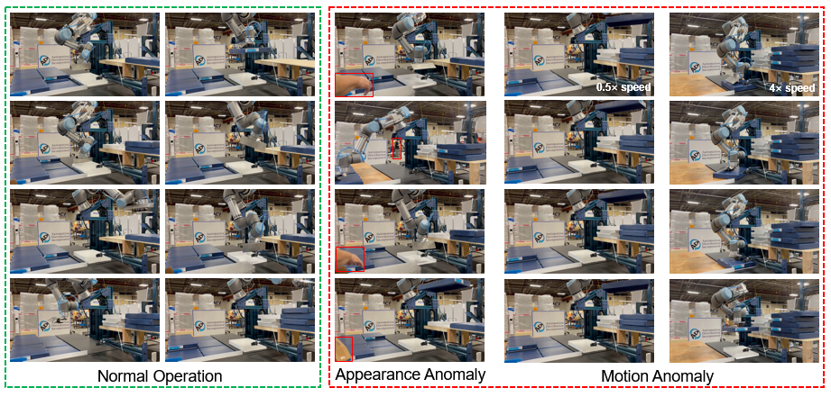

# IVAD: Industrial Video Anomaly Detection Dataset



## Introduction

To promote research on video anomaly detection in industrial scenarios and develop the automatic video anomaly detection system, we provide the first publicly available benchmark for real Industrial Video Anomaly Detection (IVAD). The initial dataset is collected from the [Internet](https://www.youtube.com/watch?v=R3HuRUup2Lw) for robotic arm working videos, totaling more than 15,000 RGB images. The negative samples are the original robotic arm working videos. In contrast, the positive samples consist of various abnormal events, including appearance-only, motion-only, and appearance-motion anomalies, fully considering the diversity and complexity of the real world. Specifically, appearance anomalies include objects that intrude into the workspace (e.g., human hands and cardboard boxes) and other unexpected targets. We simulate motion anomalies such as sudden accelerations and stops by sparse sampling and replicating the original video. In the future, we will collect large-scale VAD datasets, including various industrial scenarios such as robotic arms, assembly lines, and chemical production.

## Structure

```markdown
# IVAD
├── training
│   ├── frames
│   │   ├── 01
│   │   │     ├── 001.jpg
...
│   │   ├── 02

├── testing
│   ├── frames
│   │   ├── 01
│   │   │     ├── 001.jpg
...
│   │   ├── 02 
```

## Download

- Raw data will be uploaded to Google drive.

- All the collated data and labels will be publicly avaiable after the paper is accepted.
